# Sandbox
Sandbox environment with various research and experimentations projects implemented from scratch (physics simulations, fractals, swarm intelligence, precedural generation, computational geometry, curved space-time rendering, mathematical art, topology optimization...). All projects use the same generic UI with interactive plots, automated parameter handling and 3D display scene. The repo is standalone and should not require installing any external library.

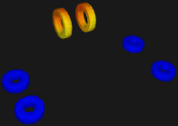
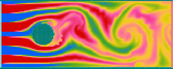
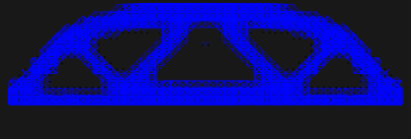
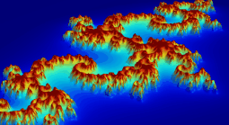
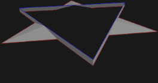
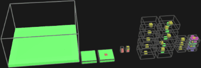\
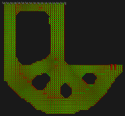
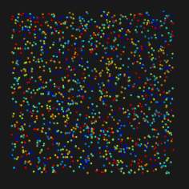
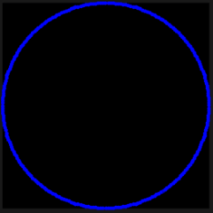
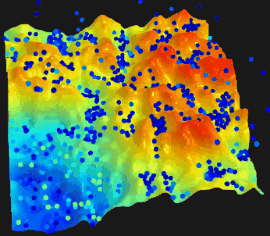
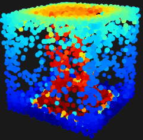

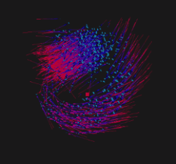

## Code structure

**Source/** contains all the sandbox environment code

**Libs/** contains imported libraries

**Build/** contains the dependency and compilation files

**FileInput/** contains various files used by the projetcs

**FileOutput/** contains various files created by the projects

**Source/main.cpp** contains the main program loop, parameter list display, mouse/keyboard interactions, creation/destruction of the active project

**Source/Data.hpp** contains the parameter list and plot data shared between the UI and each project

**Source/Projects/** contains all projects currently implemented in the sandbox environment. All projects share the same structure with initialization of their parameter list, status flags, refresh/animate/draw methods

**Source/Algo/** contains algorithms for various tasks organized in sub folders

## Minimal build env on windows
Get gcc compiler and extract at root of C: drive or another appropriate location (e.g. latest Win64 verion at the time of writing : https://github.com/brechtsanders/winlibs_mingw/releases/download/13.2.0posix-17.0.5-11.0.1-ucrt-r3/winlibs-x86_64-posix-seh-gcc-13.2.0-mingw-w64ucrt-11.0.1-r3.7z)

Doc available at  https://winlibs.com/

Install MinGW at root of C: drive or another appropriate location
https://sourceforge.net/projects/mingw/
Only check "msys-base" package in MinGW Installation Manager to just get bash commands in bin folder

Add to path env var (here shown in the case of C: drive root)
- C:\mingw64\bin
- C:\MinGW\msys\1.0\bin

## Build, run and use
- `make clean` to clean (optional, if rebuild needed)
- `make` to build (or `make -j 12` for multithread)
- `./main.exe` to run the executable
- use `rightclick` to open contextual menu, select project, change generic options or save configurations
- use menu>save>... to save UI window and current project parameters as config txt files loaded on next startup
- use `leftclick` + `nothing`/`shift`/`ctrl` to rotate/pan/zoom in the 3D scene with the arcball
- use KB arrows + modifier keys, or mouse wheel to highlight and change parameter values in the active project
- use `,` key to reset the active project
- use `.` key to step forward the animation/simulation of the active project
- use `/` key to soft-refresh the active project
- use spacebar to autoplay animation/simulation
- use `0`-`9` keys to toggle various displays in the active project
- use `a`-`z` keys to trigger operations in the active project
