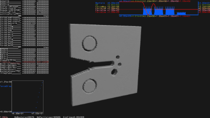

# Sandbox
Sandbox environment with various personal experimentation and a subset of research projects implemented from scratch (physics simulations, fractals, swarm intelligence, precedural generation, computational geometry, curved space-time rendering, mathematical art, topology optimization, game tree search...). All projects use the same generic UI with interactive plots, automated parameter handling and 3D scene display. The repo is standalone and should not require installing any external library.

## Code structure

**Source/** contains all the sandbox environment code

**Libs/** contains imported libraries

**Build/** contains dependency and compilation files generated during build

**FileInput/** contains various files used by the projects

**FileOutput/** contains various files created by the projects

**Source/main.cpp** contains the main program loop, parameter list display, mouse/keyboard interactions, creation/destruction of the active project

**Source/Data.hpp** contains the parameter list and plot data shared between the UI and each project

**Source/Projects/** contains all projects currently implemented in the sandbox environment. All projects share the same structure with initialization of their parameter list, status flags, refresh/animate/draw methods

**Source/Algo/** contains algorithms for various tasks organized in sub folders

## Libraries used
**Eigen** for some linear algebra (https://eigen.tuxfamily.org)

**Freeglut** for GUI handling (https://freeglut.sourceforge.net/)

**OpenCL-Wrapper** for running GPU kernels (https://github.com/ProjectPhysX/OpenCL-Wrapper)

## Minimal build env on windows
If C++20 compiler is not already present, get g++ compiler (e.g. latest Win64 version at the time of writing: https://github.com/brechtsanders/winlibs_mingw/releases/download/14.1.0posix-18.1.5-11.0.1-ucrt-r1/winlibs-x86_64-posix-seh-gcc-14.1.0-mingw-w64ucrt-11.0.1-r1.zip) and extract at root of C: drive or another appropriate location. Doc available at  https://winlibs.com/.

If bash commands are not already present, install MinGW (https://sourceforge.net/projects/mingw/) at root of C: drive or another appropriate location. Only check "msys-base" package in MinGW Installation Manager to just get bash commands in bin folder.

Add both paths to env var (here shown in the case of C: drive root)
- C:\mingw64\bin
- C:\MinGW\msys\1.0\bin

## Build, run and use
- `make clean` to delete built objects (optional, if rebuild needed)
- `make -j N` to build with `N` threads. The `FLAGS_GL` var may need to be changed to build on some OSs (only tested on a few Windows and MacOS machines) 
- `./main.exe` to run the executable
- use `right click` to open contextual menu, select project, change generic options or save configurations
- use menu>save>... to save UI window and current project parameters as config txt files loaded on next startup
- use `left click` + `nothing`/`shift`/`ctrl` to rotate/pan/zoom in the 3D scene with the arcball
- use arrows + modifier keys, or mouse wheel to highlight and change parameter values in the active project
- use `spacebar` to autoplay animation/simulation of the current project
- use `,` key to reset the active project
- use `.` key to step forward the animation/simulation of the active project
- use `/` key to soft-refresh the active project
- use `0`-`9` keys to toggle various displays in the active project
- use `a`-`z` keys to trigger operations in the active project

